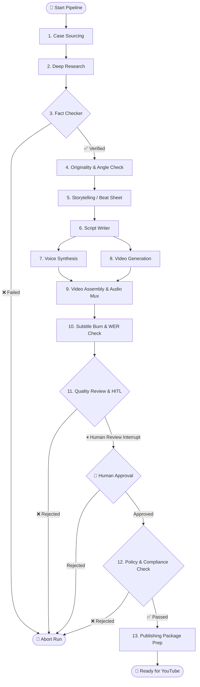

# 🎬 ai-content-for-youtube — "The Turning Point"

[](LICENSE)
[](https://www.python.org/downloads/)
[](https://github.com/langchain-ai/langgraph)
[](https://github.com/NodirKhikmatov/ai-content-for-youtube/actions/workflows/ci.yml)

> **An AI-orchestrated pipeline for producing high-retention, documentary-style YouTube videos with deliberate Human-in-the-Loop checkpoints.**

---

## 🌟 Overview

Most "AI YouTube automation" pipelines churn out generic, low-retention videos that fall foul of YouTube's **inauthentic & reused content policies**. 

**The Turning Point** takes a different approach:
* **Deep Research & Verification**: Multi-pass research (Claude + Tavily) with dedicated disconfirming-evidence gathering and fact-checking.
* **Structured 6-Beat Storytelling**: High-retention narrative structure (*Hook → Stakes → Escalation → Turning Point → Verdict → Aftermath*) with word-count & pacing constraints.
* **Anti-Cannibalization & Originality**: Uses **Voyage AI embeddings** + **pgvector cosine similarity** to ensure no topic overlaps with existing channel history.
* **Multimodal Generation**: ElevenLabs voice synthesis + Kling/Higgsfield AI video generation + ffmpeg assembly + Deepgram subtitle forced-alignment with word-error-rate (WER) verification.
* **Strict Quality & Compliance Gating**: LangGraph `interrupt()` for human editorial approval, preventing low-quality publishing.

For the full strategic vision and technical rationale, see [`blueprint.md`](blueprint.md) (or [`blueprint.html`](blueprint.html)).

---

## 🏗 Pipeline Architecture



---

## 📦 Project Structure

```
.
├── blueprint.md            # Complete architecture & platform strategy doc
├── blueprint.html          # Interactive HTML version of the blueprint
├── studio/                 # Main Python implementation
│   ├── src/studio/
│   │   ├── agents/         # 13 LangGraph pipeline agents
│   │   ├── tools/          # Voice (ElevenLabs), Video (Kling), Transcribe (Deepgram)
│   │   ├── config.py       # Pydantic settings & backend switcher
│   │   ├── db.py           # Postgres / pgvector schemas & queries
│   │   ├── graph.py        # LangGraph state machine definition
│   │   └── pacing.py       # Narration speed & word count pacing math
│   ├── scripts/            # CLI utilities (run_pipeline, mark_published, etc.)
│   ├── tests/              # Pytest suite with zero-cost mocked backends
│   ├── docker-compose.yml  # Local PostgreSQL + pgvector setup
│   ├── pyproject.toml      # Poetry / pip build configuration
│   └── README.md           # Studio-specific engineering notes
├── .github/workflows/      # GitHub Actions CI
├── CONTRIBUTING.md          # Contribution guidelines
├── CODE_OF_CONDUCT.md      # Community standards
└── LICENSE                 # MIT License
```

---

## ⚡ Quick Start

### 1. Prerequisites
* **Python**: 3.11 or higher
* **Docker & Docker Compose** (for PostgreSQL + pgvector)
* **FFmpeg**: `ffmpeg-full` with `libass` support (for burning subtitles)
  ```bash
  # macOS (Homebrew)
  brew install ffmpeg-full
  ```

### 2. Clone & Install Dependencies
```bash
git clone https://github.com/NodirKhikmatov/ai-content-for-youtube.git
cd ai-content-for-youtube/studio

python -m venv .venv
source .venv/bin/activate
pip install -e ".[dev]"
```

### 3. Start Database
```bash
docker compose up -d
```

### 4. Configure Environment
Copy `.env.example` to `.env`:
```bash
cp .env.example .env
```

> 💡 **Zero-Cost Simulation Mode**: You can run and test the entire pipeline without paid API keys! Set the backends to `fake` in `.env`:
> ```env
> VOICE_BACKEND=fake
> VIDEO_GEN_BACKEND=fake
> TRANSCRIBE_BACKEND=fake
> QUALITY_REVIEW_BACKEND=fake
> ```

### 5. Launch the Web Studio Dashboard
```bash
# Start the Web Dashboard with live reload:
uvicorn studio.web.app:app --host 127.0.0.1 --port 8080 --reload
```
Open **[http://localhost:8080](http://localhost:8080)** in your browser:
* ⚙️ **Settings Page (`/settings`)**: Input your API keys (Claude, ElevenLabs, Kling/Higgsfield, Deepgram, Gemini) or toggle to `fake` (free local simulation).
* ✨ **Create Video (`/create`)**: Input any custom title/topic (e.g. *The Fall of Enron*, *Apollo 11*, *Steve Jobs NeXT*), choose your niche, and generate a video instantly!
* 📊 **Live Monitor (`/runs/{id}`)**: Watch each agent run, review output, and approve videos with Human-in-the-Loop checkpoints.

---

### 💻 CLI Pipeline Execution (Alternative)
You can also run directly from the command line:
```bash
python scripts/run_pipeline.py
```

---

## 🧪 Running Tests

Run the full automated test suite:
```bash
cd studio
pytest
```

Run code formatting and lint checks:
```bash
ruff check .
ruff format --check .
```

---

## 🤝 Contributing

Contributions are welcome! Please check out [CONTRIBUTING.md](CONTRIBUTING.md) to get started.

---

## 📄 License

This project is licensed under the [MIT License](LICENSE).
